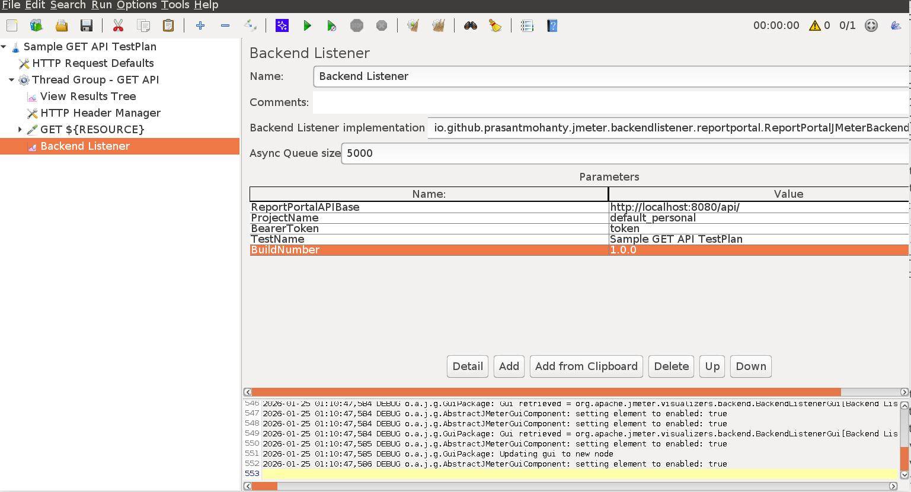

# jmeter-backend-listener-reportportal

 
A JMeter plug-in that enables you to send test results to a Report Portal server.

## What is Report Portal? 

ReportPortal is a TestOps service, that provides increased capabilities to speed up results analysis and reporting through the use of built-in analytic features.

Some of the benefits of using Report Portal 

- Real-time integration provides businesses the ability to manage and track execution status directly from the ReportPortal.
- ReportPortal provides enhanced capabilities along with auto-results analysis by leveraging historical data of test execution
- Our test report dashboard also gives you the ability to collaboratively analyze the test automation results

Find out more on this link 
https://reportportal.io/docs/

## Overview

### Description

JMeter Backend Listener ReportPortal is a JMeter plugin enabling you to send test results to a Report Portal server.
 

### Features

-   Currently it sends these details to report portal 
        -   Latency
        -   ResponseTime
        -   BuildNo 
        -   Total Test cases 
        -   Passed Test cases 
        -   Failed Test cases
        -   ResponseCode
        -   TestStartTime
        -   SampleStartTime
        -   SampleEndTime
-   This plugin listens to the responses 


### Maven dependency

```xml
<dependency>
    <groupId>io.github.prasantmohanty</groupId>
    <artifactId>jmeter.backendlistener.reportportal</artifactId>
    <version>1.0.0</version>
</dependency>
```

### Installing JMeter

-   SSH to a Unix machine with X-11 Forwarding enabled, and then set DISPLAY variable:

    ```bash
    export DISPLAY=Your_terminal_IP:0.0
    ```

-   Download [JMeter](https://jmeter.apache.org/download_jmeter.cgi) binary and extract it:

    ```bash
    mkdir -P /home/jmeter
    cd /home/jmeter
    curl -O -k http://mirror.vorboss.net/apache//jmeter/binaries/apache-jmeter-5.6.3.tgz
    tar -zxvf apache-jmeter-5.6.3.tgz
    ln -s apache-jmeter-5.6.3 ./current
    export JMETER_HOME=/home/jmeter/apache-jmeter-5.6.3
    ```

-   Download and install [Plugin Manager](https://jmeter-plugins.org/wiki/PluginsManager/) to `lib/ext` folder:

    ```bash
    curl -O -k http://search.maven.org/remotecontent?filepath=kg/apc/jmeter-plugins-manager/1.11/jmeter-plugins-manager-1.11.jar
    mv jmeter-plugins-manager-1.11.jar apache-jmeter-5.6.3/lib/ext/
    ```

    Detailed instructions on installing Plug-ins Manager are available at this [blog](https://octoperf.com/blog/2018/04/04/jmeter-plugins-install/).

-   Start JMeter:

    ```bash
    cd $JMETER_HOME
    JVM_ARGS="-Dhttps.proxyHost=myproxy.com -Dhttps.proxyPort=8080 -Dhttp.proxyUser=user -Dhttp.proxyPass=***" ./bin/jmeter.sh
    ```

### Packaging and testing your newly added code

-   Build the artefact: Execute below mvn command. Make sure JAVA_HOME is set properly

    ```bash
    mvn clean package
    ```

-   Move the resulting JAR to your `JMETER_HOME/lib/ext`.

    ```bash
    mv target/jmeter.backendlistener.reportportal-1.0.0-SNAPSHOT.jar $JMETER_HOME/lib/ext/
    ```

-   Restart JMeter

-   Go to Options > Plugins Manager

-   You will find Report Portal Backend listener plug-in mentioned in the Installed plug-ins tab.

### Configuring jmeter-backend-listener-reportportal plug-in

-   In your **Test Pan**, right click on **Thread Group** > Add > Listener > Backend Listener
-   Choose `io.github.prasantmohanty.jmeter.backendlistener.reportportal.ReportPortalBackendClient` as `Backend Listener Implementation`.
-   Specify parameters as shown in image below (**ReportPortalAPIBase** , **ProjectName** and **BearerToken** are mandatory ones): 



### Running your JMeter test plan

You can run the test plan in GUI mode by clicking the **Start** button  


## Screenshots


### For more info

For more information, here's a little [documentation](https://github.com/prasantmohanty/jmeter-backend-listner-reportportal Portal/wiki).

## Contributing

Feel free to contribute by branching and making pull requests, or simply by suggesting ideas through the "Issues" tab.

